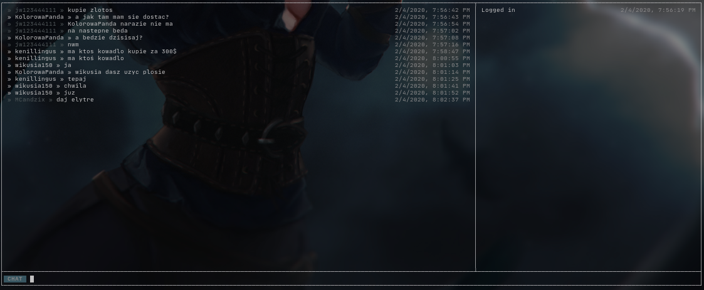

# mineflayer-dashboard
A dashboard layout for single mineflayer bot.



## Table of contents

<!-- toc -->

- [Installation](#installation)
  * [Install using yarn](#install-using-yarn)
  * [Install using npm](#install-using-npm)
- [Initialization](#initialization)
- [Layout](#layout)
- [Logging](#logging)
  * [Error logging](#error-logging)
- [Modes](#modes)
  * [Included modes](#included-modes)
  * [Defining custom modes](#defining-custom-modes)
    + [Example `whisper` mode](#example-whisper-mode)
- [Commands](#commands)
  * [Running commands](#running-commands)
  * [Available commands](#available-commands)
  * [Custom commands](#custom-commands)

<!-- tocstop -->

## Installation
### Install using yarn
Install the package with yarn
```shell script
yarn add mineflayer-dashboard
```
### Install using npm
Install the package with npm
```shell script
npm install --save mineflayer-dashboard
```
## Initialization
Then load up the plugin using mineflayer.
You can pass `options` argument:
- `chatPattern` - a pattern that is tested against a message to determine if it's chat message or a system message. It's better to add this option as mineflayer's chat pattern will match messages like `[SkinsRestorer] Your skin has been changed.`. Also custom patterns are much faster than mineflayer's default one.
```js
bot.loadPlugin(require('mineflayer-dashboard')({
  chatPattern: /^» \w+? » /
}))
// or
bot.loadPlugin(require('mineflayer-dashboard'))
```

## Layout
```
+--------------------+-----------+
|                    |           |
|                    |           |
|     MODE WINDOW    |    LOG    |
|                    |           |
|                    |           |
+----+---------------+-----------+
|MODE| TEXT INPUT                |
+----+---------------------------+
```

- **TEXT INPUT** - Here you insert your text / commands
- **MODE** - Mode indicator, tells you current mode
- **LOG** - Here you can print out some stuff
- **MODE WINDOW** - Here you can print out mode related stuff

## Logging
Logging in log window is accessible by using `bot.dashboard.log` function. 

**NOTE:** Please do **not** use `console.log` as it may create some unwanted artifacts. If any other dependency is using `console.log` you may try to overwrite this function by
```shell script
global.console.log = bot.dashboard.log
global.console.error = bot.dashboard.log
```

### Error logging
All error logging is passed to the dashboard log window. That means all of the error handlers created before plugin load are no longer listened. This was a crucial step to maintain the layout of the app.

## Modes
### Included modes
Dashboard comes with 2 modes:
- `CHAT` - Default mode. In `CHAT` mode you can see all of the chat messages sent to the player.
- `REPL` - In `REPL` mode you can run javascript code to control over your bot.

### Defining custom modes
We expose `Mode` class in the `bot.dashboard`.

The first parameter is mode name. It'll be used to create `:<name>` command to switch to this mode

Second one is options:
- `fg` - foreground color for mode indicator
- `bg` - background color for mode indicator
- `interpreter` - It defines what is happening when you hit enter in the text input. Bound to mode instance
- `completer` - This function should return `String[]` or `Promise<String[]>` with the completions to current string. Bound to mode instance
  - A single completion needs to be the remainder of the completed string. For example, when I want to complete nickname `wvffle` and I hit `<tab>` with cursor posiotioned in position `wv|` then I need to return `[ 'ffle' ]`
- `bypassDefaultCompletion` - bypass default completion system, don't cache matches.

#### Example `whisper` mode
When in this mode, we can send messages to different players. To change the reciever simply add ` :to <user>` at the end of the message
```js
let lastUser = null
const whisper = new bot.dashboard.Mode('whisper', {
  bg: 'blue',
  interpreter (string) {
    let words = string.split(' ')

    // Check if we change receiver
    if (/ :to \w{3,16}$/.test(string)) {
      lastUser = words[words.length - 1]
      words = words.slice(0, -2)
    }
    
    // Log an error if there is no receiver
    if (lastUser === null) {
      return bot.dashboard.log("No receiver set, please add ' :to <user>' at the end of the message")
    }   

    // Send message
    const message = words.join(' ')
    bot.chat(`/msg ${lastUser} ${message}`)
    this.println(`to ${lastUser}: ${message}`)
  },
  async completer (string) {
    // We're using already well defined minecraft completer
    return bot.dashboard._minecraftCompleter(string)
  }
})

bot.on('whisper', (username, message) => {
  // Log a notification if not in whisper mode
  if (bot.dashboard.mode !== whisper) {
    return bot.dashboard.log(`You have a new message from ${username}`)
  } 

  // Display messages in the mode
  whisper.println(`${username}: ${message}`)
})
```

## Commands
### Running commands
Simply type `:<command> arg1 arg2...`
```shell script
:say wvffle "I like waffles"
```
**NOTE:** In this case `:say` is a custom command<br>
**NOTE:** In this case `"I like waffles"` is a string passed as arg2

### Available commands
We provide some basic commands for the dashboard.
- `:help` - Display available commands
- `:exit` - Kill the bot / exit the application
- `:clear` - Clear mode window
- `:<mode>` - Change to `<mode>` mode
  - `:chat` - Change to `CHAT` mode
  - `:repl` - Change to `REPL` mode
  
### Custom commands
You can add custom commands by simply doing
```js
bot.dashboard.commands['say'] = (user, ...words) => {
  const sentence = words.join(' ')
  bot.chat(`/forcesay ${user} ${sentence}`)
}
```
